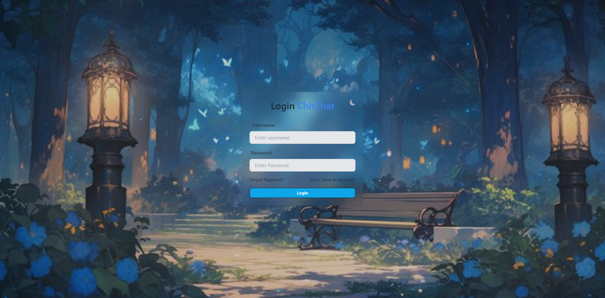
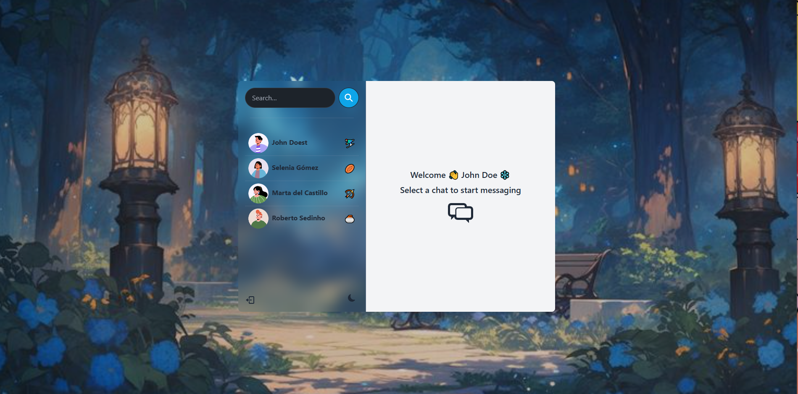

# Real-Time Chatting Application

This project is a **real-time chatting application** built using the **MERN stack** (MongoDB, Express, React, and Node.js). It allows users to engage in dynamic, real-time conversations with one another. The application is responsive and scalable, designed to deliver a seamless chatting experience.

## Table of Contents

- [Features](#features)
- [Screenshots](#screenshots)
- [Technologies](#technologies)
- [Getting Started](#getting-started)
  - [Prerequisites](#prerequisites)
  - [Installation](#installation)
  - [Running the Project](#running-the-project)
- [Usage](#usage)
- [Contributing](#contributing)
- [License](#license)

## Features

- **Real-time messaging**: Users can send and receive messages instantly.
- **MongoDB** for efficient data storage of conversations and user info.
- **Responsive user interface** built with **React**.
- **Express** and **Node.js** to manage the backend API and WebSocket connections.
- **Socket.io** for real-time communication.
- **User authentication**: Login and registration functionality.

## Screenshots

### 1. Login Page

### 2. Chat Interface

## Technologies

- **Frontend**: React.js
- **Backend**: Node.js, Express.js
- **Database**: MongoDB
- **Real-Time Communication**: Socket.io

## Getting Started

### Prerequisites

Before you begin, ensure you have the following installed:

- **Node.js** (v12 or higher)
- **MongoDB** (Ensure MongoDB is running locally or on a remote server)
- **npm** or **yarn**

### Installation

1. Clone this repository:
   \`\`\`bash
   git clone https://github.com/shambhaveesrivastava12/ChittChat.git
   cd ChittChat
   \`\`\`

2. Install dependencies for both the frontend and backend:

   - Backend:
     \`\`\`bash
     cd backend
     npm install
     \`\`\`
   - Frontend:
     \`\`\`bash
     cd ../frontend
     npm install
     \`\`\`

3. Create a `.env` file in the backend folder to configure environment variables (e.g., MongoDB connection string, JWT secret).

   \`\`\`bash
   PORT=5000
   MONGO_DB_URI=your_mongo_db_uri
   JWT_SECRET=your_jwt_secret
   NODE_ENV=development
   \`\`\`

   ### 💡For mongodb link, use cloud.mongodb.com -> Create Deployment -> Create User -> Allow Traffic 0.0.0.0 -> Connect via drivers ->Use username and password in project.
   
   ### 💡For jwttoken, use '''openssl rand -base64 32''' in your terminal.

### Running the Project

1. **Start the backend server**:
   \`\`\`bash
   cd backend
   npm run server
   \`\`\`

2. **Start the frontend React app**:
   \`\`\`bash
   cd ../frontend
   npm run dev
   \`\`\`

3. **Access the application**:
   Open your browser and go to `http://localhost:5000`.

### Docker container setup

1. **Frontend setup**:
   -cd frontend
   -cd docker-compose up -d

   this will get the frontend running in a container
   you can access it at `http://localhost:3001`.
   No need to download the dependencies locally

2. **Backend setup**:
   -cd backend
   -cd docker-compose up -d

   this will get the backendend running in a container
   you can access it at `http://localhost:3000`.
   No need to download the dependencies and setting up mongodb locally

## Usage

- Register for an account or log in with an existing one.
- Start a chat with online users and enjoy real-time messaging.

## Contributing

If you'd like to contribute, feel free to submit a pull request or open an issue.

## License

This project is licensed under the MIT License.

## 🎉 Hacktoberfest

This project is participating in Hacktoberfest 2025! 🍂
We welcome contributions from developers of all levels.

### ✅ What you can contribute:

Fix bugs 🐛

Add new features 🚀

Improve documentation 📚

Enhance UI/UX 🎨

### ❌ What will not be accepted:

Spammy or low-quality PRs

Automated PRs without meaningful contribution

Inspiration: )

